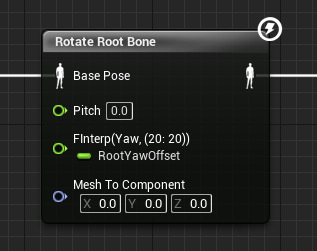
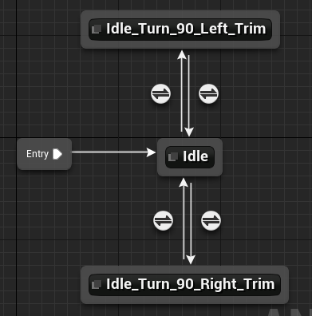
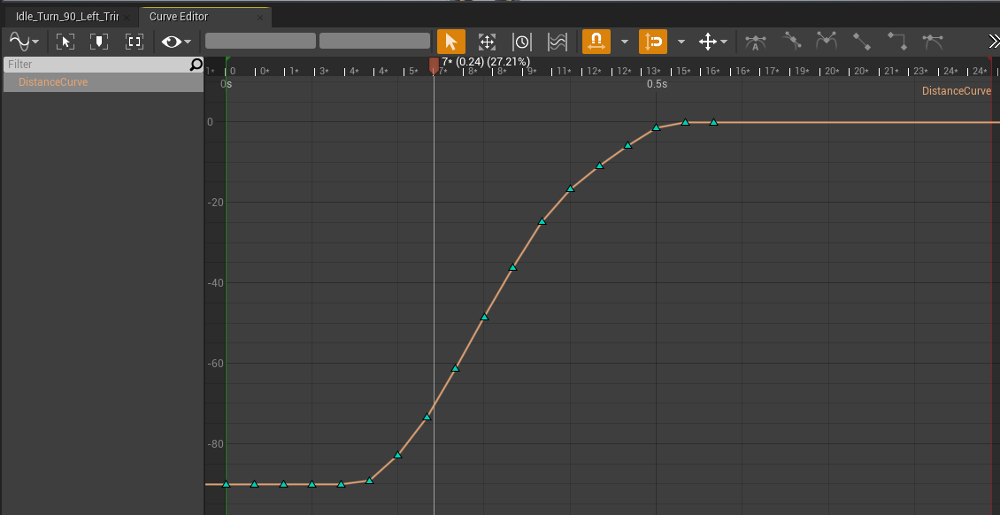

# 动画系统

> 官方系列教程：https://www.youtube.com/watch?v=ffuq5k-j0AY&t=3627s&ab_channel=UnrealEngine
>
> ​	part3：https://www.twitch.tv/videos/278640857

## 0 基础概念

### Montage相关

- **Anim Montage**: 动画蒙太奇可包含一个或多个动画的资产。它至少有一个Section - 称为 "Default"。可以在蒙太奇时间轴的任意位置向蒙太奇添加新的Section。您可以随意移动、调整等。
- **Montage Section**: 动画蒙太奇的组成部分，用于将蒙太奇分割成可单独播放的片段。播放蒙太奇时，蒙太奇将从头开始播放。不过它并不会总是按顺序播放所有蒙太奇片段。哪些段落会在其他段落之后播放，取决于蒙太奇Section选项卡中的配置，可通过Window -> Montage Sections进行访问：
  - 在 C++ 中，使用 Montage_Play()播放蒙太奇，使用 Montage_JumpToSection()播放单个Section。
- **Slot**: 插槽Slot是一种标识符，是一种可以分配给动画蒙太奇的标签。当一个动画蒙太奇使用了一个特定的slot时，该slot可用于选择性地将pose信息添加到使用特定动画蓝图的角色中，具体做法是在动画 BP 中添加一个slot节点，并选择相关的slot名称。在播放蒙太奇时，动画蓝图中的pose将通过使用给定slot的slot节点 "添加 "到该姿势数据中。我在 "添加 "前加了引号，因为这取决于蒙太奇中的动画是否是Addictive的。
  - 如果不是Addictive，在播放时，姿势将被蒙太奇中的动画完全覆盖。
  - 如果这些动画是Addictive的，它们将被添加到通过槽节点输入的姿势数据之上。

### Blend 节点

> 官方文档：https://docs.unrealengine.com/4.26/en-US/AnimatingObjects/SkeletalMeshAnimation/NodeReference/Blend/

- **Layered Blend Per Bone**[官方讲解](https://youtu.be/ffuq5k-j0AY?t=3627): 假如我们想在跑步时开枪，此时只需要上半身开枪，下半身跑步，就可以用这个节点实现。

  - base pose 0是基础的运动动画

  - base pose 1是需要在某骨骼上混合的动画，例如开枪动画

  - Blend Weights是Additive pose的影响程度，1代表Additive完全添加到Base pose中，看源码`AnimationRuntime.cpp`这应该是混合的上限，如下。

  - ```c++
    float TargetBlendWeight = BlendWeights[PoseIndex] * SrcBoneBlendWeights[BoneIndex].BlendWeight;
    ```

  - Branch Filters: 这里设置混合的Bone Name和Blend Depth

    - Bone Name: 骨骼名，如pelvis, spine_01, thigh_01等等。

    - Blend Depth: 混合深度，代表每层深度添加的混合权重。源码中这么写的：

      - ```c++
        // how much weight increase Per depth
        const float IncreaseWeightPerDepth = (BranchFilter.BlendDepth != 0) ? (1.f/((float)BranchFilter.BlendDepth)) : 1.f;
        ```

    - 例如Bone Name = "pelvis"， Blend Depth = 4。此时每层添加的权重就是1/4 = 0.25。blend的顺序是pelvis，spine_01, spine_0, spine_03。到达spine_03后，它将播放100%混合后的开枪动画。其它的如pelvis只播放25%, spine_01播放50%, spine_02播放75%。

    - 当Blend Depth设置为-1时，表示不要blend这部分bone

## 1 C++基类创建

创建`UAnimInstance`的C++子类`UShooterAnimInstance`作为我们的动画蓝图基类。

在C++中，首先我们重写`UAnimInstance`自带的两个函数来初始化和更新动画所需变量。如下：

```c++
//每帧调用， 更新角色的运动状态变量
virtual void NativeUpdateAnimation(float DeltaSeconds) override;

//初始化函数
virtual void NativeInitializeAnimation() override;
```

之后我们前向声明角色类，用于获取角色当前状态。还要三个变量用来状态机的转换

```c++
UPROPERTY(VisibleAnywhere, BlueprintReadOnly, Category=Moement, meta = (AllowPrivateAccess = "true"))
class AShooterCharacter* ShooterCharacter;

//角色当前速度
UPROPERTY(VisibleAnywhere, BlueprintReadOnly, Category=Movement, meta = (AllowPrivateAccess = "true"))
float Speed;

//角色是否在空中
UPROPERTY(VisibleAnywhere, BlueprintReadOnly, Category=Movement, meta = (AllowPrivateAccess = "true"))
bool bIsInAir;

// 判断角色是否在移动
UPROPERTY(VisibleAnywhere, BlueprintReadOnly, Category=Movement, meta = (AllowPrivateAccess = "true"))
bool bIsAccelerating;
```

角色指针初始化如下：

```c++
ShooterCharacter = Cast<AShooterCharacter>(TryGetPawnOwner());
```

Update函数里它们的更新逻辑如下：

```c++
if(ShooterCharacter)
{
    //更新速度
    FVector Velocity = ShooterCharacter->GetCharacterMovement()->Velocity;
    Velocity.Z = 0.f;
    Speed = Velocity.Size();

    //更新是否在空中
    bIsInAir = ShooterCharacter->GetCharacterMovement()->IsFalling();

    //更新是否在移动
    bIsAccelerating =
        ShooterCharacter->GetCharacterMovement()->GetCurrentAcceleration().Size() > 0.f ? true : false;
}
```

## 2 动画蓝图创建

创建蓝图子类ABP_Shooter，创建基础状态机，使用刚刚的三个变量作为过渡条件，红圈地方可以设置为自动过渡。

可以通过裁剪动画，使得过渡更平滑


## 3 混合空间 BS

### 3.1 使用Yaw Offset混合动画

我们希望角色根据Aim和Movement方向的Offset来播放不同的动画，比如按D时播放向右跑动画，按S时播放向后跑动画。

因此我们需要创建三个Blend Space，对应JogStart，Run(2D)，JogEnd三种状态。

- 首先在C++中计算YawOffset的值，再从蓝图里获取

  - 第一步获取两个Rotation值

    - ```c++
      //获取角色和相机的角度offset
      FRotator AimRotaion = ShooterCharacter->GetBaseAimRotation();//跟随相机旋转改变值
      FRotator MovementRotation = ShooterCharacter->GetVelocity().Rotation();//跟随输入方向改变值
      ```

  - 再计算Offset

    - ```c++
      MovementOffsetYaw = UKismetMathLibrary::NormalizedDeltaRotator(MovementRotation, AimRotaion).Yaw;
      ```

- 在编辑器里创建BS1D，坐标轴使用YawOffset: [-180, 180]；使用jog_Fwd/Bwd/Left/Right动画，示意图如下：

  - 注意设置左上角**Interpolation Time**可以在在BS内的不同动画间平滑过渡，避免抽搐


- 最后在ABP中应用即可
  - ！注意JogStop的特殊处理，由于YawOffset计算需要Velocity的值，当角色停下时，Velocity总会归零，所以此时YawOffset总为0，因此播放的总是Jog_Fwd_Stop动画。要解决这个问题需要我们**记录前一帧的YawOffset**，并在Velocity为0/bIsAccelerate为false时停止更新，此时JogStop可以正常运行。

- 此外就是trim动画，使其更自然
- 如果想实现JogStop时角色还能轻微滑动，可以在角色类的MovementComponent里Walking类别下设置Ground Friction = 2，Braking Deceleration Walking = 80即可

## 4 添加开枪动画

想要的效果：上半身开枪，下半身跑步。

使用layered blend per bone节点，只需要在附加的pose前加上slot节点使得其可以被蒙太奇动画覆盖就可以实现。

节点中设置骨骼名为spine_01, 深度设置>=0即可。

## 5 Aiming

添加状态机，维护变量`bAiming`用于正常和瞄准状态间转换。

Aiming状态就是一个单帧pose和Locomotion做Layered Blend。另外调整节点中的Blend Weight就能实现瞄准时开枪也有轻微动画

## 6 Jumping

Tips: 在状态机中也能加状态机

## 7 Turn In Place

 Turn In Place是指我们站在原地时，当镜头旋转角度和角色正对方向到一定角度后，角色会自己转到我们镜头面对方向的一种高级动画机制。接下来说明如何把它加到ABP中。

### 7.1 基础变量创建

先在`ShooterAnimInstance.h`里创建几个变量，如下：

```c++
//记录当前角色的Rotation Yaw
float CharacterYaw;
float LastCharacterYaw;

//记录当前角色相机旋转和Root方向的Yaw Offset
UPROPERTY(VisibleAnywhere, BlueprintReadOnly, Category=TurnInPlace, meta = (AllowPrivateAccess = "true"))
float RootYawOffset;

//在旋转动画播放期间动画曲线的值
float CurveYaw;
float LastCurveYaw;
```

首先在角色类中我们有如下设置，即角色会跟随鼠标旋转但不随输入方向旋转。

```c++
bUseControllerRotationYaw = true;
GetCharacterMovement()->bOrientRotationToMovement = false;
```

但现在我们想让鼠标转到一定角度以后再让角色转过来，所以我们用一个变量`RootYawOffset`记录这个差值并每帧更新。

### 7.2 动画蓝图

有了变量后，我们在动画蓝图里添加`Rotate Root Bone`节点，把`RootYawOffset`的值绑定到Yaw上面。此时我们就能实现相机转但角色不转的效果了。



接下来在原来的Idle动画处创建一个状态机，把Idle和Turn In Place的动画放在一起，结构如下：



其中的转换条件就是用`RootYawOffset`的值等等。

### 7.3 动画曲线

在Turn In Place动画里分别创建两个曲线，一个记录root的yaw旋转角度变化，一个meta Curve标记当前正在播放此动画（恒为1）。第一个曲线如下图所示，大致是一个从-90到0的曲线。其实只要上下限符合均可。



### 7.4 TurnInPlace函数实现

有了状态机，动画曲线等准备工作，接下来我们就根据这些值来更新`RootYawOffset`。

首先是`RootYawOffset`的计算更新过程：

```c++
LastCharacterYaw = CharacterYaw;//记录上一帧的Yaw
CharacterYaw = ShooterCharacter->GetActorRotation().Yaw;//更新现在的yaw
const float YawOffset = CharacterYaw - LastCharacterYaw;//现在和上一帧之间的差值
//RootYawOffset clamp到[-180, 180]
RootYawOffset = UKismetMathLibrary::NormalizeAxis(RootYawOffset - YawOffset);//更新
```

下面是旋转动画播放时`RootYawOffset`额外的更新，首先我们获取动画曲线里和上一帧的差值，并根据左转/右转把差值加到`RootYawOffset`上。此外还有补偿的操作，这是因为旋转时我们的角度一般不会正好等于90度，而如果不补上多出来的部分，就会导致角色和相机方向有偏差，会出现抽搐。加上补偿的角度后，不管我们转多少度，最终角色都能转到初始时的方向。

```c++
if (GetCurveValue(FName(TEXT("Turning"))) == 1.f)//此时正在播放turning动画
{
    LastCurveYaw = CurveYaw;
    CurveYaw = GetCurveValue(FName(TEXT("DistanceCurve")));
    const float CurveYawOffset = CurveYaw - LastCurveYaw;
    if (RootYawOffset > 0)
    {
        //向左转，root yaw需要减小
        RootYawOffset = UKismetMathLibrary::NormalizeAxis(RootYawOffset - CurveYawOffset);
    }
    else
    {
        //向右转
        RootYawOffset = UKismetMathLibrary::NormalizeAxis(RootYawOffset + CurveYawOffset);
    }
    //补偿多出来的yaw
    const float ABSRootYawOffset = FMath::Abs(RootYawOffset);
    if (ABSRootYawOffset > 90.f)
    {
        const float YawExcess =  ABSRootYawOffset - 90.f;
        RootYawOffset > 0 ? RootYawOffset -= YawExcess : RootYawOffset += YawExcess;
    }
}
else
{//重置操作，保证每次都从-90开始
    CurveYaw = -90.f;
}
```


最终效果如下所示：


