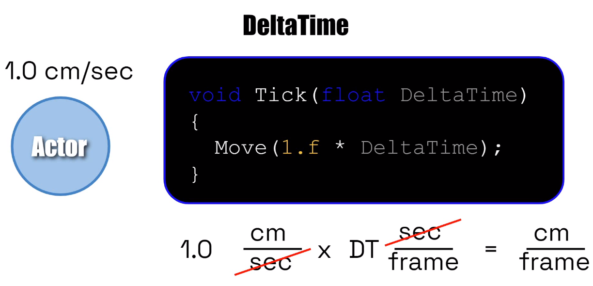
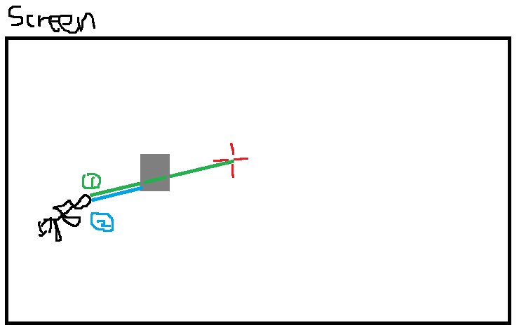

# Character

> 这个文档描述如何在C++中从最基础的ACharacter类建立功能完善的角色类，作为自己学习过程的记录。

## 0 准备工作

首先创建ACharacter的C++子类ShooterCharacter，并在编辑器中创建相应的蓝图类BP_ShooterCharcter。

打开蓝图可以发现角色类有一些默认组件：

- Capsule Componennt：胶囊体，代表角色在游戏中的碰撞，它作为Root所有组件只能接在它下面。
- Arrow，用来指示角色正面面向的方向
- Movement Component，管理角色运动

打开C++类有一些默认函数：

- AShooterCharacter()： 构造函数，用来初始化变量
- BeginPlay()：游戏开始或角色在关卡里生成时调用
- SetupPlayerInputComponent(): 用来绑定用户输入的函数，由PlayerController调用

## 1 相机系统

在游戏中，我们在屏幕中看到的视角通常会固定在角色身后，所以这里我们需要在角色身后绑定一个相机。

我们需要一个弹簧臂用来连接和相机，这里用UPROPERTY把它们暴露在蓝图中。

```c++
	UPROPERTY(VisibleAnywhere, BlueprintReadOnly, Category=Camera, meta = (AllowPrivateAccess = "true"))
	class USpringArmComponent* CameraBoom;

	UPROPERTY(VisibleAnywhere, BlueprintReadOnly, Category=Camera, meta = (AllowPrivateAccess = "true"))
	class UCameraComponent* FollowCamera;
```

之后在构造函数里初始化它们：

大致三步操作：

1. 创建实例
2. 设置attach的地方
3. 其它参数设置

```c++
	//弹簧臂初始化
	CameraBoom = CreateDefaultSubobject<USpringArmComponent>(TEXT("CameraBoom"));
	CameraBoom->SetupAttachment(RootComponent);
	CameraBoom->TargetArmLength = 300.f; //长度
	CameraBoom->bUsePawnControlRotation = true; //弹簧臂跟随controller旋转

	//相机初始化
	FollowCamera = CreateDefaultSubobject<UCameraComponent>(TEXT("FollowCamera222"));
	FollowCamera->SetupAttachment(CameraBoom, USpringArmComponent::SocketName);
	FollowCamera->bUsePawnControlRotation = false; //相机不跟随controller旋转
```

tips：

- USpringArmComponent::SocketName是自带的socket，位于弹簧臂末端

- RootComponent是每个Actor都自带的

## 2 输入系统

### 2.1 前后左右移动

首先在项目设置中添加Axis Mapping：

- MoveForward
  - W
  - S: Scale = -1
- MoveRight
  - D
  - A: Scale = -1

接下来在C++中绑定并应用这些操作

首先在头文件里定义两个函数分别用于前后/左右移动

```c++
	void MoveForward(float Value);
	void MoveRight(float Value);
```

函数体实现如下，首先获取Controller的**Yaw**旋转角度，再获取该角度(forward)下的**X方向**的单位向量，最后把Value添加到这个方向的输入中。MoveRight同理，只是换成了Y(Right)轴

```c++
void AShooterCharacter::MoveForward(float Value)
{
	if (Controller && Value != 0.f)
	{
		const FRotator Rotation{Controller->GetControlRotation()};
		const FRotator YawRotation{0.f, Rotation.Yaw, 0.f};
		const FVector Direction{FRotationMatrix{YawRotation}.GetUnitAxis(EAxis::X)};
		AddMovementInput(Direction, Value);
	}
}
```

最后在`SetupPlayerInputComponent`函数中绑定这两个函数到输入映射上。、

```c++
// Called to bind functionality to input
void AShooterCharacter::SetupPlayerInputComponent(UInputComponent* PlayerInputComponent)
{
	Super::SetupPlayerInputComponent(PlayerInputComponent);
	check(PlayerInputComponent);
	//分别是项目设置中的映射名和c++中的函数名
	PlayerInputComponent->BindAxis("MoveForward", this, &AShooterCharacter::MoveForward);
	PlayerInputComponent->BindAxis("MoveRight", this, &AShooterCharacter::MoveRight);
}
```


### 2.2 上下左右视角移动

#### 2.2.1 Tips

- Deltatime相关知识

  - **Delta Time**: 帧之间的间隔

  - **Frame**： 屏幕上更新的单张图像

  - **Frame Rate**： 每秒中更新的图像数量（FPS）

  - **Tick**：和frame一个意思

-  角色移动和帧的关系：假设actor每秒移动1cm，乘以deltatime就能得到每帧需要移动的长度



#### 2.2.2 使用方向键控制视角

首先在项目设置中添加Axis Mapping：

- TurnRate
  - →
  - ←: Scale = -1
- LookUpRate
  - ↑
  - ↓: Scale = -1

然后在头文件里定义两个变量，分别表示左右和上下的基础速率，在构造函数中初始化为45.f：

```c++
UPROPERTY(VisibleAnywhere, BlueprintReadOnly, Category = Camera, meta = (AllowPrivateAccess = "true"))
float BaseTurnRate; //单位是 度/秒

UPROPERTY(VisibleAnywhere, BlueprintReadOnly, Category = Camera, meta = (AllowPrivateAccess = "true"))
float BaseLookUpRate; //单位是 度/秒，
```

再定义两个函数处理左右和上下视角变换

```c++
  void TurnAtRate(float Rate); //Rate 介于0-1之间, 1代表100%是我们期望速率

  void LookUpAtRate(float Rate); //Rate 介于0-1之间
```

函数实现如下,里面计算的是当前帧需要改变的角度值,

```c++
void AShooterCharacter::TurnAtRate(float Rate)
{
	// deg/sec * sec/frame = deg/frame
	AddControllerYawInput(Rate * BaseTurnRate * GetWorld()->GetDeltaSeconds());
}

void AShooterCharacter::LookUpAtRate(float Rate)
{
	AddControllerPitchInput(Rate * BaseLookUpRate * GetWorld()->GetDeltaSeconds());

}
```

最后把函数绑定到axis mapping上

```c++
PlayerInputComponent->BindAxis("TurnRate", this, &AShooterCharacter::TurnAtRate);
PlayerInputComponent->BindAxis("LookUpRate", this, &AShooterCharacter::LookUpAtRate);
```

此时我们就能通过方向键控制角色的视角了。

#### 2.2.3 使用鼠标控制视角

> 当我们希望获得一致、恒定的转动速度时，就会使用DeltaTime。DeltaTime 可以补偿帧速率偏差，但当我们移动鼠标时，鼠标轴输入提供的是上一帧和这一帧之间的绝对延迟。我们并不希望这个转动速率是恒定的，而是希望它能准确反映我们自上一帧以来移动鼠标的次数。

|      | TurnAtRate                                                   | Turn                        |
| ---- | ------------------------------------------------------------ | --------------------------- |
| 区别 | 调用时使用rate，它结合了 delta time，可在按下按钮（开或关）时获得与帧速率无关的恒定运动。 | 从鼠标移动中获取 delta 值。 |

在项目设置里添加Turn和LookUp两个映射，对应鼠标X轴和Y轴。

之后再把它们与APawn自带的函数绑定

```c++
PlayerInputComponent->BindAxis("Turn", this, &APawn::AddControllerYawInput);
PlayerInputComponent->BindAxis("LookUp", this, &APawn::AddControllerPitchInput);
```

> 使用下来没感觉到区别，，，

### 2.3 跳跃

创建Action Mapping

然后在C++中与角色类自带的Jump函数绑定

```c++
PlayerInputComponent->BindAction("Jump", IE_Pressed, this, &ACharacter::Jump);
```

## 3 动画系统

> 这里主要写在角色类实现的与ABP相关的内容

### 3.1 controller与输入方向的控制切换

初始我们设置角色只根据输入的方向旋转自己，Controller只转Camera Boom

```c++
//角色不跟随controller(鼠标)旋转，controller只影响camera
bUseControllerRotationPitch = false;
bUseControllerRotationYaw = false;
bUseControllerRotationRoll = false;


GetCharacterMovement()->bOrientRotationToMovement = true;//角色跟随输入的方向旋转
GetCharacterMovement()->RotationRate = FRotator(0.f, 540.f, 0.f);

GetCharacterMovement()->JumpZVelocity = 600.f;
GetCharacterMovement()->AirControl = 0.2f;//[0, 1]在空中时输入的影响
```


## 4 粒子特效

包括开枪时枪口火花，子弹轨迹的smoke，命中时的flash


## 5 子弹轨迹计算

我们在屏幕中间绘制应该十字准星Crosshair，每次开枪时，子弹的飞行轨迹是**从枪口到准星瞄准的第一个物体**，因此我们需要对此进行计算

0. 把trace的起点终点定义为Start和End

1. 先获取Screen的中心位置，然后使用`UGameplayStatics::DeprojectScreenToWorld`将准星位置从屏幕**反投影**到3d空间中(即相机的Location和Direction)
2. 用准星的Location和Direction做trace，把end**更新**为第一个Hit到的位置
3. 此时从枪口位置到end做trace时仍然可能有物体遮挡，所以如果Hit到物体，需要再次**更新**End，此时的End就是子弹轨迹和最终命中位置了！！
4. 示意图如下所示，其中绿色线是**第二次trace**，其终点为camera的forward方向的Hit位置。若它有BlockingHit，那么就更新最终trace的Hit位置，更新后结果为蓝色线。



## 6 Aiming

### 6.1 FOV缩放

每次瞄准时缩小FOV，松开按键恢复。

可以在tick函数里实现，这里我使用Timer实现，维护一个变量`CameraCurrentFOV`记录当前的FOV值

- 按下瞄准键时创建Timer

  - ```c++
    GetWorldTimerManager().SetTimer(FOVTimer, this, &AShooterCharacter::UpdateFOV, ZoomTimerInterval, true, -1.f);
    ```

- 然后不断更新FOV值直到达到预先设定的值

  - ```c++
    GetFollowCamera()->SetFieldOfView(CameraCurrentFOV);
    ```

- 这里使用`FMath::FInterpTo`方法做插值，这个插值更新速度和AB的距离成反比，所以最终效果是开始很快，然后慢慢结束，和我们瞄准的体感很接近

### 6.2 鼠标灵敏度

瞄准时更新`BaseTurnRate`和`BaseLookUpRate`即可

### 6.3  准心缩放

这部分想实现的效果是当我们奔跑/跳跃/瞄准/射击时，准心相应地**发散和聚焦**。

- 首先我们要把原来一整个的准心贴图改成**四个方向**的贴图，再分别DrawTexture

- 在角色类定义`CrosshairSpreadMultiplier`该值**每帧更新**，计算此时Crosshair的偏移量。HUD类每次更新时读取该值并应用在Texture的位置上。下面介绍四种准心更新的方法：

  - `VelocityFactor`：根据当前速度缩放

    - ```c++
      CrosshairVelocityFactor = FMath::GetMappedRangeValueClamped(//把当前速度map到[0,1]
      		WalkSpeedRange,//[0,MaxWalkSpeed]
      		VelocityMulRange,//[0,1]
      		GetVelocity().Size2D());
      ```

  - `InAirFactor`：在空中时发散，落地后恢复

    - ```c++
      if (GetCharacterMovement()->IsFalling())//这里更新两种方式都行
      {
          CrosshairInAirFactor = FMath::FInterpTo(CrosshairInAirFactor, 1.f, DeltaTime, 2.5);
      }
      else
      {
          float Delta = CrosshairInAirFactor - 0.08f;
          CrosshairInAirFactor = FMath::Clamp(Delta, 0.f, 1.f);
      }
      ```

  - `AimFactor`：瞄准时聚焦，取消后恢复，实现方法和air类似

  - `ShootingFactor`：开一枪后准心轻微放大，然后迅速缩小。

    - 实现方法是设置一个bool `bFiringBullet`，每次开枪后开启一个Timer将其设为true，call back函数再设为false。然后更新过程和air也类似。

  - 最终的`CrosshairSpreadMultiplier`更新如下：

    - ```c++
      	//计算最终的Delta值，HUD类会读取
      	CrosshairSpreadMultiplier = 0.5f //设置一个基础的delta值
      		+ CrosshairVelocityFactor
      		+ CrosshairInAirFactor
      		+ CrosshairAimFactor
      		+ CrosshairShootingFactor;
      ```

- 在HUD类更新时，根据Top/Bottom/Left/Right将Multiplier应用到X/Y方向上即可。

## 7 自动开火

给鼠标左键的IE_Pressed和IE_Released各绑定一个函数，然后使用Timer不断触发FireWeapon函数即可。
