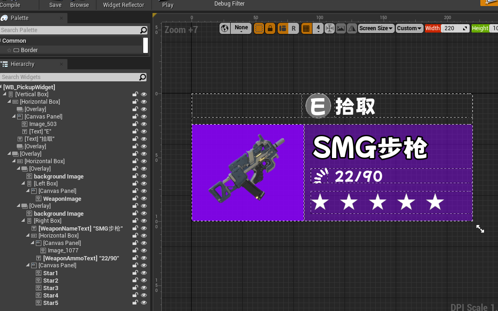

## 1 UMG(Unreal Motion Graphics)

### 1.1 Canvas Panel

- 可以在里面随意摆放widgets

- 可以选择anchor，当canvas大小变化时，widgets和anchor的**距离不会改变**。

### 1.2 Overlay

- UI元素可以一层层堆在上面

### 1.3 Horizontal/Vertical Box

在里面水平/垂直排列元素

## 武器拾取UI

通过Overlay，Horizontal/Vertical Box，Canvas Panel等的组合实现。

